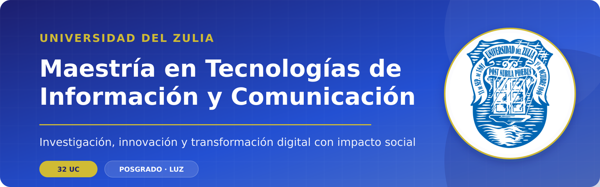

  

  <a href="#programa">Programa</a> ·
  <a href="#plan-de-estudios">Plan de estudios</a> ·
  <a href="#perfil-del-egresado">Perfil del egresado</a> ·
  <a href="#admisión">Admisión</a> ·
  <a href="#asignaturas-y-recursos">Asignaturas</a> ·
  <a href="#contacto">Contacto</a>

  
  
  

> [!IMPORTANT]
> **Convocatoria 2026-I cerrada.** La información de una próxima cohorte se publicará cuando sea anunciada oficialmente. Para consultas, escribe a [mticluz.admision@gmail.com](mailto:mticluz.admision@gmail.com).

## Programa

La **Maestría en Tecnologías de Información y Comunicación** de la Universidad del Zulia es un programa de formación avanzada orientado al estudio, diseño y aplicación de soluciones tecnológicas para responder a desafíos académicos, productivos y sociales.

El programa integra fundamentos de computación, ingeniería de software, bases de datos, redes, sistemas distribuidos, inteligencia artificial, análisis de datos e investigación. Su propósito es formar profesionales capaces de liderar procesos de transformación digital, generar conocimiento científico aplicado y contribuir al desarrollo sostenible de su entorno.

### ¿A quién está dirigida?

- Personal académico y de investigación en áreas relacionadas con las TIC.
- Profesionales en Computación, Informática, Sistemas y Telecomunicaciones.
- Egresados de ingenierías, licenciaturas y carreras afines interesados en investigación e innovación tecnológica.

## La maestría en cifras

| Grado | Duración académica | Carga total | Orientación |
|:--|:--:|:--:|:--|
| **Magíster Scientiarum en Tecnologías de Información y Comunicación** | 4 semestres | **32 UC** | Investigación aplicada |

## Elige tu ruta

| Aspirantes | Estudiantes | Investigadores |
|:--|:--|:--|
| Conoce el perfil de ingreso, el proceso de selección y el plan de estudios. | Accede progresivamente a programas, recursos y proyectos de las asignaturas. | Explora áreas de conocimiento, líneas de trabajo y producción académica. |
| [Ir a Admisión](#admisión) | [Ver asignaturas](#asignaturas-y-recursos) | [Explorar áreas](#áreas-de-conocimiento) |

## Perfil del egresado

La persona egresada será un profesional integral, con compromiso social y capacidad técnica para liderar procesos de transformación digital. Estará en capacidad de:

- Diseñar, implementar, mantener y evaluar soluciones complejas de software, datos, redes, sistemas distribuidos e inteligencia artificial.
- Generar y difundir conocimiento científico aplicado mediante proyectos y redes de investigación nacionales e internacionales.
- Asesorar y transferir conocimiento especializado a universidades, comunidades y organizaciones de los sectores público y privado.
- Contribuir a la reducción de la brecha digital y a la inclusión social mediante la formación de talento humano.
- Resolver problemas del entorno con una perspectiva interdisciplinaria, ética y sostenible.
- Mantener un proceso de aprendizaje continuo ante la evolución de las tecnologías.

## Áreas de conocimiento

  
  
  
  
  

## Plan de estudios

### I semestre · 8 UC

| Unidad curricular | UC |
|:--|:--:|
| Fundamentos de la Computación | 2 |
| Ingeniería del Software y Base de Datos | 2 |
| Redes y Sistemas Distribuidos | 2 |
| Sistemas Inteligentes | 2 |

### II semestre · 9 UC

| Unidad curricular | UC |
|:--|:--:|
| Electiva I | 2 |
| Electiva II | 2 |
| Formulación de un Problema de Investigación en TIC | 2 |
| Análisis y Procesamiento Estadístico de Datos | 3 |

### III semestre · 9 UC

| Unidad curricular | UC |
|:--|:--:|
| Electiva III | 2 |
| Electiva IV | 2 |
| Redacción Técnica de Investigación Avanzada en TIC | 2 |
| Gerencia de Proyectos de Investigación | 3 |

### IV semestre · 6 UC

| Unidad curricular | UC |
|:--|:--:|
| Trabajo de Grado: ejecución y presentación de resultados de investigación en TIC | 6 |

<strong>Total: 32 unidades de crédito</strong>

<strong>Materias electivas</strong>

- Administración e Implantación de Bases de Datos
- Almacenes y Minería de Datos
- Base de Datos Orientada a Objetos
- Ingeniería de Requisitos
- Interacción Humano-Computador
- Prueba de Software
- Teoría y Métodos de las TIC
- Administración de Proyectos Telemáticos
- Auditoría Telemática Avanzada
- Codificación y Compresión de Datos
- Seguridad Telemática Avanzada
- Bioinformática
- Lingüística Computacional
- Introducción a los Agentes Inteligentes

> La oferta de electivas puede variar según la planificación académica de cada cohorte.

## Admisión

### Requisitos generales de ingreso

1. Poseer un título de licenciatura o ingeniería en Computación, Sistemas, Informática, Telecomunicaciones o un área relacionada.
2. Contar con un promedio mínimo de **13 puntos** en los estudios de pregrado.
3. Participar en el proceso de preinscripción y selección.
4. Presentar los recaudos solicitados por la coordinación del programa.

### Proceso de selección

~~~mermaid
flowchart LR
    A["Evaluación de credenciales"] --> B["Prueba de conocimientos"]
    B --> C["Entrevista"]
    C --> D["Resultado de admisión"]
~~~

Los recaudos, aranceles, fechas y datos administrativos pueden cambiar entre cohortes. Antes de realizar cualquier pago o consignación, solicita la convocatoria y el instructivo vigentes a la coordinación.

## Asignaturas y recursos

Este espacio se ampliará progresivamente con los programas oficiales de las unidades curriculares, bibliografía, recursos de aprendizaje, proyectos estudiantiles y resultados de investigación.

| Componente | Próximamente |
|:--|:--:|
| Programas de las asignaturas | 🔜 |
| Recursos y bibliografía | 🔜 |
| Proyectos estudiantiles | 🔜 |
| Producción académica | 🔜 |
| Líneas de investigación | 🔜 |

## Coordinación

**Coordinador:** Dr. Alfredo Acurero

## Contacto

Para información académica y administrativa:

📧 [mticluz.admision@gmail.com](mailto:mticluz.admision@gmail.com)

---

  <strong>Maestría en Tecnologías de Información y Comunicación</strong> 
  Universidad del Zulia · Facultad Experimental de Ciencias

  Este espacio se encuentra en construcción y se actualizará progresivamente con información académica y recursos del programa.

