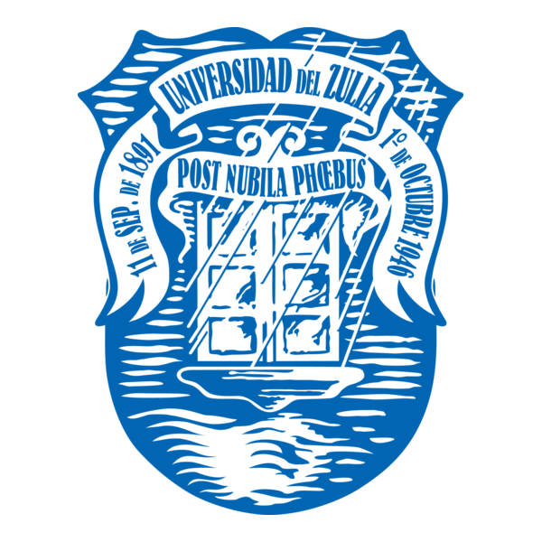

&nbsp;&nbsp;&nbsp;&nbsp;&nbsp;&nbsp;

# Maestría en Tecnologías de Información y Comunicación

### Universidad del Zulia · Facultad Experimental de Ciencias

**Formación avanzada para investigar, diseñar y transformar organizaciones mediante las Tecnologías de Información y Comunicación.**

[Conoce el programa](#conoce-el-programa) · [Plan de estudios](#plan-de-estudios) · [Admisión](#admisión) · [Investigación](#investigación)

---

## Conoce el programa

La **Maestría en Tecnologías de Información y Comunicación de la Universidad del Zulia** es un programa de formación avanzada orientado al estudio, diseño y aplicación de soluciones tecnológicas para responder a necesidades académicas, científicas y organizacionales.

Integra fundamentos de computación, gestión de información, análisis de datos, ingeniería de software, sistemas inteligentes e investigación aplicada.

## La Maestría en cifras

| 32 unidades crédito | Título académico | Institución | Orientación |
|:---:|:---:|:---:|:---:|
| **32 UC** | **Magíster Scientiarum** | **Universidad del Zulia** | **Investigación aplicada** |

## Elige tu ruta

| Aspirantes | Estudiantes | Investigadores |
|---|---|---|
| Conoce el perfil de ingreso, los requisitos y el proceso de admisión. | Consulta asignaturas, recursos académicos y proyectos. | Explora líneas de investigación, producción académica y oportunidades de colaboración. |
| [Información de admisión](#admisión) | [Plan de estudios](#plan-de-estudios) | [Investigación](#investigación) |

## Áreas de conocimiento

- Inteligencia Artificial y sistemas inteligentes
- Ingeniería y arquitectura de software
- Datos, analítica e inteligencia de negocios
- Tecnologías de Información y Comunicación
- Gestión de información y transformación digital
- Metodología e investigación aplicada

## Plan de estudios

El programa contempla **32 unidades crédito** distribuidas entre asignaturas obligatorias, asignaturas electivas, formación para la investigación y el trabajo de grado.

La información detallada de cada asignatura —propósito, contenidos, estrategias de aprendizaje y referencias— se incorporará progresivamente en repositorios académicos específicos.

## Asignaturas destacadas

- Sistemas Inteligentes
- Ingeniería de Software y Bases de Datos
- Análisis y Procesamiento Estadístico de Datos
- Arquitectura de Software
- Interacción y Experiencia de Usuario
- Gerencia de Proyectos de Investigación
- Ingeniería de Plataformas Digitales

## Investigación

El programa promueve proyectos vinculados con:

- Inteligencia Artificial, agentes y sistemas basados en conocimiento
- Ingeniería, calidad y arquitectura de software
- Ciencia, ingeniería y analítica de datos
- Plataformas digitales y computación en la nube
- Interacción humano-computador y experiencia de usuario
- Aplicación estratégica de las TIC en organizaciones y comunidades

## Proyectos y producción académica

Este espacio reunirá progresivamente:

- Proyectos y prototipos desarrollados por estudiantes
- Trabajos de grado y resultados de investigación
- Artículos, ponencias y presentaciones académicas
- Recursos abiertos y demostraciones tecnológicas
- Repositorios asociados con asignaturas y líneas de investigación

## Comunidad académica

La sección de comunidad presentará al personal docente, investigadores, estudiantes y egresados vinculados con el programa, junto con sus perfiles profesionales y académicos en **LinkedIn, ORCID, Google Scholar y GitHub**, cuando estén disponibles.

## Tecnologías

`Python` · `JavaScript` · `SQL` · `GitHub` · `Docker` · `Cloud Computing` · `Machine Learning` · `RAG` · `Bases de datos` · `Analítica de datos`

## Admisión

Aquí se publicarán la convocatoria vigente, requisitos de ingreso, documentos requeridos, cronograma, aranceles y canales oficiales de atención.

> **Importante:** las fechas, los aranceles y los datos administrativos deben verificarse siempre en la convocatoria vigente del programa.

## Contacto y enlaces institucionales

- **Universidad del Zulia**
- **Facultad Experimental de Ciencias**
- **Postgrado de la Facultad Experimental de Ciencias**
- **Maestría en Tecnologías de Información y Comunicación**

Los canales oficiales de contacto y las redes profesionales serán incorporados después de su validación institucional.

---

**Maestría en Tecnologías de Información y Comunicación — Universidad del Zulia**

*Conocimiento, investigación e innovación para la transformación digital.*

